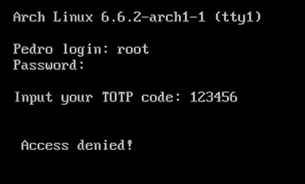
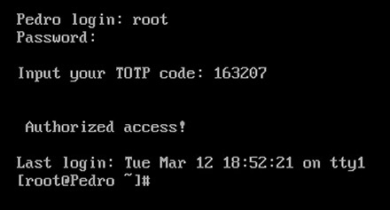
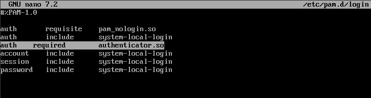

 
# PAM module - TOTP in Arch Linux

## Description
 
This project aims to configure and implement the PAM TOTP module during login, using the Arch Linux distribution (without graphical interface). The languages used were C and Python. The C language was used to create the user and authenticate them, while Python was used in the RFC 6238 process.

Either the Google Authenticator app or the website 'https://totp.danhersam.com' can be used to obtain the TOTP code for login authentication after following the steps and implementing the codes and configurations.

It is important to note that the Google Authenticator library is not used on Linux. The entire Linux implementation is done through code.
	

## Explanation of Codes

### createUser: User creation and random key generation

The createUser function is responsible for creating a user on Linux with a username and password. It also generates a 16-character random key using the following code snippet:

Declarations:
char secretKey[17];    
const char characters[] = "234567ABCDEFGHIJKLMNOPQRSTUVWXYZ";    
int size, i;

Code responsible for the random key (line 24 to 32):

    // The 'secretKey' will be generated automatically
    srand(time(NULL));

    for(i=0;i<16;i++){
        secretKey[i] = characters[rand() % size];
    }

    secretKey[16] = '\0';
    printf("\nSave your secret key in Google Authenticator or on the website indicated at readme.md\n -> Your secret key: %s\n\n", secretKey);

The root user's secret key is already predefined. The key is: JBSWY3DPEHPK3PXP. You can change it in the file authenticator.c.

This key must be kept safe and registered in Google Authenticator or on the website. It will be used later.

### authenticator.c : User authentication with TOTP

The authenticator.c code is responsible for authentication. To do this, it queries the random key .txt file and, based on the username entered in the login 'Username' field, it finds the corresponding random key. The random key is sent to the TOTPgenerator.py code written in Python using the pipe function. Thus, through the open standard RFC 6238, it generates a 6-digit TOTP access key, which is the same as the one generated by Google Authenticator or the website mentioned above. This new key is saved in a temporary file.

Returning to code 2, it accesses and then deletes the temporary file for security reasons and to prevent memory leaks, extracting the TOTP key from the file.

After the previous process, the user is prompted to enter the TOTP key after the 'password' field during login. The TOTP key can be obtained from Google Authenticator or from the website: "https://totp.danhersam.com/". After entering the key, the code compares it and either authorizes or denies access.

## Installation and configuration
To implement this project, follow these steps:

Install the libraries:

gcc: for compiling the C code.
ntp: for synchronizing the clock with the local time.
pam: for Linux to obtain the necessary packages to use the PAM module.

To do this, follow these steps:

* sudo pacman -Sy gcc 

* sudo pacman -S ntp

* sudo pacman -Sy pam

* sudo systemctl enable ntpd.service

* sudo systemctl start ntpd.service

* nano createUser.c (write the createUser code)

* gcc -o createUser createUser.c

* nano TOTPgenerator.py ( write the  TOTPgenerator.py code)

* nano authenticator.c -> (write the authenticator.c code)

Before proceeding, it is strongly recommended to back up your data, as any mistakes could lock you out of your machine. Therefore, double-check everything before implementing!

* gcc -fPIC -shared -o authenticator.so authenticator.c -lpam

* sudo cp authenticator.so /lib/security/

* sudo nano /etc/pam.d/login

* Append to the end of the file:
 “auth 	required 	authenticator.so”
 

Remember to save the file!

* reboot

## Purpose:

This project aims to implement two-factor authentication during user login on Arch Linux (without a graphical interface).

Creating a User:

To create a user using the createUser.c script, run the following command:  "./createUser.c"

## Contributions:
For this project, the following resources were used:

TOTP Code Generation: https://totp.danhersam.com/

RFC 6238 Documentation: https://datatracker.ietf.org/doc/rfc6238/

Understanding the Concepts: https://supertokens.medium.com/what-is-totp-and-why-do-you-need-it-bb83a5331e51

Base Python Code: https://medium.com/analytics-vidhya/understanding-totp-in-python-bbe994606087

Researches: https://www.ibm.com/docs/pt-br/aix/7.3?topic=modules-pam
